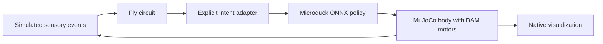

DuckFly feasibility, inspected 10 September 2026
================================================

Yes: a self-contained Mac app that puts a simulated Microduck body under the influence of a fly-derived neural circuit is a practical project. The first version should let the circuit select movement intent and retain a learned Microduck controller for balance. Direct control of the duck's joints from fly leg motor neurons is a separate research problem.

This folder contains research and test evidence, not an implemented application. The existing local Microduck checkout was left unchanged. Public sources were cloned into a temporary directory. Exact revisions, environment details and evidence hashes are in [the manifest](evidence/2026-09-10/manifest.json).

**What each repository contributes**

| Source | Reusable parts | Boundary to preserve |
|---|---|---|
| [Microduck RL](https://github.com/pollen-robotics/microduck_rl/tree/53b8971b61baf5b7f3c16d135dd7cac37623de4b) | MJCF robot and meshes; CPU MuJoCo inference; BAM motor dynamics; training/export reference | The exported policy expects exact observation conventions and matching actuator behavior. |
| [Microduck runtime](https://github.com/pollen-robotics/microduck/tree/4f795a6795e02808f999bca9e483bf08fca03e55) | Observation builder; policy loading and safety; the RobotIo/RemoteIo simulation interface | Physical joint arrays have 15 slots, including the mouth; policy arrays have 14. A standalone simulator does not need the board's service infrastructure. |
| [DesktopFly neural core](https://github.com/DenisSergeevitch/desktop-fly/blob/32b00011e83c3dc85fa3ea0b3934155b04f1635d/Sim.swift) | Swift spiking circuit, typed population outputs, deterministic test fixtures | Wiring is measured anatomy; excitability and effective synaptic behavior are modeled. |
| [DesktopFly application](https://github.com/DenisSergeevitch/desktop-fly/tree/32b00011e83c3dc85fa3ea0b3934155b04f1635d) | Brain inspection, stimulus injection, pause controls, optional desktop overlay | Its fly mechanics and scripted behavior transitions are not a biped balance controller. |

DesktopFly simulates 668 selected FlyWire neurons and a separate 1,045-neuron MaleCNS locomotor circuit. Its 23,210 displayed soma positions are a visualization dataset; they are not all simulated neurons. The bridge between the female and male specimens is explicitly modeled. Its neural parameters do not establish biological fidelity or learning. See its [evaluation](https://github.com/DenisSergeevitch/desktop-fly/blob/32b00011e83c3dc85fa3ea0b3934155b04f1635d/EVALUATION.md).

The six-leg MaleCNS outputs carry insect muscle-channel meanings. Microduck has two legs with five driven joints each, plus head/neck control. Relabeling the outputs cannot supply the missing biped balance dynamics. Think of the fly circuit as giving movement directions and the duck controller as knowing how to stay upright while following them.

**Recommended control path**



Start with the FlyWire circuit's descending activity. DNp09 can influence forward drive and DNa activity can influence turning. A Giant Fiber event can request a bounded retreat or stop, chosen according to verified duck capabilities. Flying is not available to this body. Every mapping is an engineered behavior rule, not a newly discovered biological connection.

Leave the six-leg motor circuit out of the initial control path. It can remain available as an inspectable reference experiment. A later study could train a small body-specific readout or bounded residual from that circuit, but it must compete with a simple adapter and a matched random-network control before receiving a scientific interpretation.

Preserve the duck policy's `obs[1,61] -> actions[1,14]` contract: 48 proprioceptive values followed by 13 command values. Preserve projected gravity, joint order, home-pose offsets and the normalizer baked into the model. The brain changes supported command slots, not the observation layout. Keep the 15-slot runtime mapping separate from policy actions.

The desired time model is 1 ms neural steps, 5 ms physics steps and 20 ms policy updates, with rendering independent of simulation time. A single simulation clock should own pause and reset. Spikes requesting a reflex must be latched until the policy update consumes them. The current DesktopFly 120 Hz body clock belongs to its own fly mechanics; it is not a reason to change Microduck's policy rate.

Use measured MuJoCo motion for sensory feedback. Synthetic looming can initially come from geometry in a controlled arena. A mapping from duck foot contact to fly ascending activity must be documented as a model assumption. Drawing a feedback arrow is not evidence that this coupling works.

**What ran on this Mac**

DesktopFly compiled with Swift 6.2 on an Apple M2 Max. Its circuit diagnostic passed, all 23 behavior checks passed, and all 18 locomotor checks passed. These were the upstream seeded fixtures, run once. They establish repeatable software behavior in those fixtures, not robustness across new noise seeds or agreement with live flies. [Native logs](evidence/2026-09-10/fly-locomotortest.log)

The official `alpha_walking.onnx` from policy revision `916c1e1...` loaded with exactly the expected input/output shapes. The CPU probe used the current public inference script, upstream scene, and the existing local Python environment. Each trial ran for 10 simulated seconds, with no actuator delay. [Initial probe](evidence/2026-09-10/microduck-probe.json) and [higher-command follow-up](evidence/2026-09-10/microduck-probe-higher-commands.json)

| BAM condition | Observed result |
|---|---|
| Idle | Remained upright in the 10-second trial. |
| Forward command 0.1 m/s | Only about 6 mm of world-x displacement. Tracking is not established. |
| Forward command 0.3 m/s | World displacement x=0.918 m, y=-0.388 m. No diagnostic fall; maximum tilt about 4.12 degrees. This shows motion with substantial directional/velocity error. |
| Backward command -0.3 m/s | About -2.5 mm of world-x displacement. Useful backward walking is not established. |

Turning commands were exercised, but the probe did not retain heading trajectories. Position alone cannot grade turn tracking. Across the valid BAM trials, per-trial p99 compute time was approximately 0.48–0.81 ms per 20 ms tick. No timed tick exceeded 20 ms. This excludes rendering and the fly engine, as well as process communication. It supports CPU feasibility for one body, not an integrated app performance claim.

The first provisional harness used the inference class's raw-accelerometer default. That was incompatible with this model's projected-gravity input. Those results were discarded; the corrected harness asserts the initial gravity values and command slots. This is exactly why an explicit observation contract matters.

One source mismatch deserves attention: `sim/body_server.py` and the runtime documentation describe a BAM-based body, but the inspected body server calls `mj_step` on XML position actuators and scales their gains. It does not call the live BAM torque/friction controller. The newer `scripts/infer_policy.py` does. Reuse that tested BAM path when building the standalone engine, and add parity checks before claiming equivalent physics. [Body server](https://github.com/pollen-robotics/microduck_rl/blob/53b8971b61baf5b7f3c16d135dd7cac37623de4b/src/mjlab_microduck/sim/body_server.py), [inference implementation](https://github.com/pollen-robotics/microduck_rl/blob/53b8971b61baf5b7f3c16d135dd7cac37623de4b/scripts/infer_policy.py)

The current runtime also supports explicit LSTM state and reset handling. Earlier local notes that described every runtime policy as stateless are outdated for this public snapshot. That does not automatically make a fly circuit compatible with its policy loader.

**What the standalone repository needs**

Use a native SwiftUI/AppKit shell with the neural core extracted into a Swift module. For a new renderer, use RealityKit to display poses produced by MuJoCo. Keep MuJoCo as the physics authority; a second independent physics engine would make the visible body disagree with the measured one. Apple now [discourages SceneKit for new applications](https://developer.apple.com/videos/play/wwdc2025/288/), although DesktopFly's existing SceneKit implementation still builds.

Initially bundle a private Python runtime with the CPU MuJoCo/BAM/ONNX worker inside the application. That preserves the reference implementation while avoiding a user-installed Python environment. A later native engine can use MuJoCo and ONNX Runtime's C interfaces, but porting BAM must pass numerical comparisons first. This packaging proposal has not been implemented or tested here.

The app bundle needs a pinned robot asset set and tested policy weights, plus circuit data with separate license notices. It also needs a resource loader that reads the application bundle: DesktopFly currently searches beside its executable or under the working directory. Fresh-machine installation must be tested with the source checkouts unavailable and networking disabled.

A reasonable repository layout is:

```text
App/                    native window, brain inspector and stimulus controls
Packages/FlyCircuit/    circuit loading and neural simulation
Engine/                 bundled CPU worker and explicit command/sensor protocol
Resources/              pinned robot, policy and circuit assets with licenses
Tests/                  contract parity, behavior controls and installation checks
```

Start with an arena window. Include manual commands and neural commands as separate selectable modes. Expose the activity-to-command mapping alongside physical telemetry, with reproducible resets and trace replay. Add the desktop overlay after the arena establishes correct motion. The first version does not require training on the Mac or access to a robot.

**What must pass before expansion**

1. Establish a command envelope for a pinned policy/body pair. Forward tracking and turning need measured trajectories; backward commands must remain unsupported until demonstrated. Measure falls and command errors across fresh initial conditions.
2. Connect the fly circuit to that verified envelope. Compare the same stimulus episodes with a manual/scripted controller. Silence relevant neural outputs and remove sensory feedback in separate controls. Record neural activity and commands so behavior cannot quietly bypass the circuit.
3. If claiming an advantage from fly wiring, compare a degree/sign-matched shuffled graph and a matched random recurrent controller. Match adapter capacity and tuning budget. A pleasant desktop pet does not require a connectome superiority claim.
4. Package and verify the complete offline app. Check synchronized resets, renderer/physics agreement and deadline behavior under UI load. No integrated coupling or installation check was run in this exploration.

**Data licensing affects the product choice**

DesktopFly code is MIT, but its FlyWire `circuit.json` and `brain_points.json` are labeled CC BY-NC 4.0. Its separate MaleCNS files are labeled CC BY 4.0. Microduck repositories and the inspected public policy card declare Apache-2.0. Preserve all notices and verify any asset-specific terms before distribution. A commercial bundle must resolve the FlyWire noncommercial terms or use a separately licensed circuit; replacing it changes what is being simulated. [DesktopFly data license](https://github.com/DenisSergeevitch/desktop-fly/blob/32b00011e83c3dc85fa3ea0b3934155b04f1635d/data/DATA_LICENSE.md)

The next concrete milestone is a native arena app with reliable manual Microduck motion, then fly-driven intent under identical conditions. A claim that an insect connectome has learned to balance a biped would require a different experiment.
