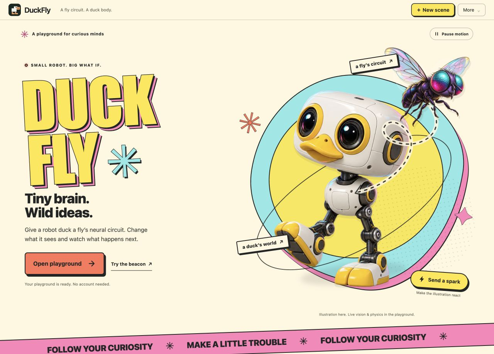
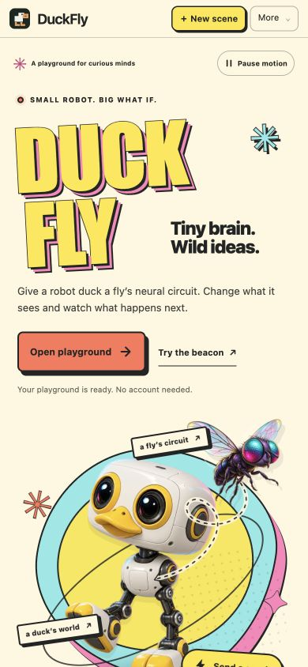

# Animated welcome page

DuckFly opens with an illustrated welcome page in the browser and standalone Mac app. Original transparent duck and fly artwork sits over a bright comic-poster composition inspired by [Microduck's homepage](https://pollen-robotics.com/microduck/). No reference-site artwork was copied.

**Open playground** reveals the existing scene gallery immediately. **Try the beacon** opens the same reviewed setup wizard used by scenario tiles once the local engine is ready. Cancelling keeps the welcome page and restores keyboard focus. The top-level **New scene** button also works here.

**More → Welcome page** brings the introduction back and pauses the existing simulation without replacing it. The gallery's **Continue your scene** restores that stage; **Run** resumes its retained state. Direct shared-scene URLs bypass the introduction.

The fly drifts and the robot bobs using CSS transforms. **Send a spark** triggers a short decorative response and never sends a neural stimulus or worker command. The page labels the artwork as an illustration. Motion pauses when the page or browser document is hidden; an explicit pause preference persists locally. System reduced-motion preferences default the animation to paused, with a deliberate Play option.

## Files

- `web/src/lab/launch-page.js` owns the markup and presentation controls; `web/src/launch-page.css` scopes the welcome-page appearance.
- `web/src/main.js` owns page transitions and engine readiness. The physics worker is unchanged.
- [Artwork and exact generation prompts](artwork.md), including original generated-file provenance.
- `mac/Tests/launch-smoke.js` covers the launch lifecycle through the packaged WebKit app; shared scene helpers now enter through the visible gallery.

## Verification

The production Vite build passes, as do all 88 Node tests. Browser checks at 1280, 563, 390 and 320 pixels show no horizontal overflow or JavaScript errors. Actual changing transform matrices confirm animation in the visible browser; Pause stops all decorated layers. Beacon cancellation restores focus and the gallery retains all 11 tiles.

A fault-injection server deliberately returns HTTP 503 for the robot asset. The welcome page retains a clear error after the temporary toast disappears, disables the beacon shortcut, and still allows gallery entry. `failing-assets-server.py` reproduces that check against the current built app on local port 5198.

The native launch suite passes six checks, including exact neural/body state isolation for decorative motion, reviewed scene movement, and direct shared-scene initialization. The native setup suite passes all 10 checks. Logs and JSON receipts are retained beside this document. Native acceptance checks inspect computed layout and real runtime state; they do not establish smooth native painting while the Mac display is locked.

These local receipts cover the initial welcome-page candidate. The subsequent shared studio theme and final release validation are documented in [studio-theme](../studio-theme/README.md). `initial-build.json` identifies the earlier launch-only build.

