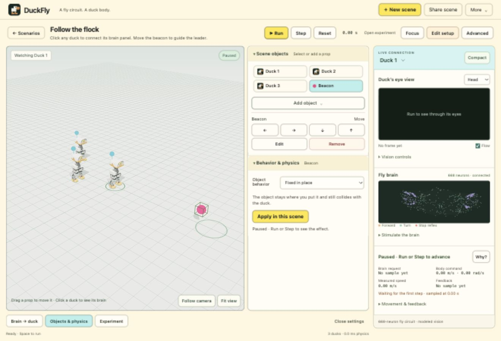
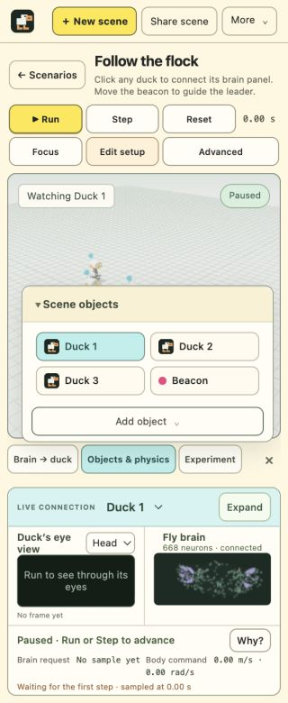

# A consistent DuckFly studio

The welcome page's cream background and colorful accents now carry throughout the app, from the scene catalog to guided setup. Inside the editor, small text and restrained borders preserve the compact work surface. Primary actions use lemon or coral; cyan identifies the current selection. Camera images and neural plots retain their original rendering colors.

## Inspector behavior

The studio has one contextual inspector. Selecting a prop opens its object controls and physics together. Brain connections and experiment controls use the same space, as does Advanced. Switching intent closes the previous group while keeping the underlying controls mounted, so fields and selection are retained.

At widths of 1200 pixels and above, the inspector docks beside the stage. On narrower windows it becomes a contained drawer above the settings rail. The connected duck's brain monitor remains outside the inspector and visible. Focus mode temporarily hides editing panels, then restores the previous inspector and its scroll position when exited. Returning home closes the inspector.

The inspector tracks current UI intent only. Presentation preferences and window geometry never enter a scene definition or recording.

## Implementation

- `web/src/studio-theme.css` colors the catalog and studio chrome, including auxiliary dialogs.
- `web/src/setup-theme.css` colors the guided setup without changing its draft editing behavior.
- `web/src/lab/workspace-layout.js` owns panel state and moves the existing Advanced controls into the shared inspector.
- `web/src/workspace-panels.css` controls docking and the responsive drawer.

## Verification notes

Browser and native UI acceptance run sequentially. An earlier concurrent run recorded an AppKit mouse action terminating the foreground native test app; that attempt is retained as incomplete evidence. With browser automation idle, the unchanged flock diagnostic passed its disconnect and reconnection checks, including zero commands to the disconnected body while its circuit continued firing.

Current validation receipts and screenshots are retained alongside this document.

The final browser pass checks a 320-pixel phone layout, an 820-pixel drawer, and a 1320-pixel docked studio with no horizontal overflow. It also checks Focus restoration, Advanced exclusivity, Escape behavior, and a mobile wizard edit retained across the preview/control views. Browser warning and error logs are empty. All 88 Node tests pass. See `browser-checks.json` and `node-tests.log`.

The first native playground attempt used non-cancelable synthetic Escape events. Unlike real keyboard input, those events cannot set `defaultPrevented`, so a later key handler processed the same event again. The test now uses cancelable keyboard events while preserving its restoration assertions. A real browser Escape keypress independently restored Advanced, the open Scene settings disclosure, and exactly 604 pixels of scroll position. No product-code change was needed for that test failure.

The final `DuckFlyStudioVerified.app` passed all five serial native suites: launch (6 receipt groups), playground (4), setup (10), and workspace (14), followed by the entire 11-scene catalog. The catalog includes 11 disconnect/reconnect control sets and 11 live interactions, with no uncaught errors. Its final checks cover a distant beacon, covered-eye gating, patrol/orbit motion, and gravity/heavy props. `native-summary.json` indexes the receipts. The workspace learning gate retained the original adapter weights; it is a functional regression check, not evidence of a new learning improvement.

## Release

Published to the existing ContextMind Vercel project at [duckfly.vercel.app](https://duckfly.vercel.app/). Deployment `dpl_3YySykDsNcVAiVfEr978NjPM8rf8` is READY in production. The public HTML and entry assets match the browser-tested build byte for byte; the verification includes the physics worker and both illustrations. See `../launch-page/production-assets.json`.

The refreshed production browser loads both illustrations, opens the themed studio, and runs the beacon scene with visible camera input and body response. The drawer also fits the actual 563-pixel app panel, with no horizontal overflow. Browser warning and error logs are empty; see `production-browser.json`. The published welcome page is left open for review.

Mac version 0.10.0 (build 11) was installed at `~/Applications/DuckFly.app` and opened successfully to the ready welcome page. Its 71 files match the tested bundle and its local signature verifies. The previous installation is retained under `mac/build/backups/`. See `mac-install.json` for paths and hashes.

