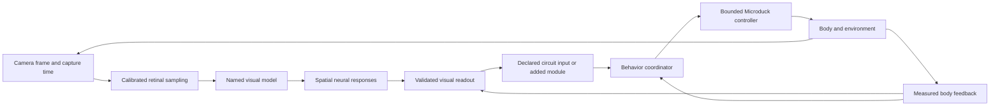

# Fly vision to robot behavior

Research proposal · September 10, 2026

DuckFly can support much richer behavior by preserving the structure of visual responses and giving the robot a small set of competing actions. The best next step is a spatial vision experiment followed by a bounded behavior controller. A bigger connectome alone would not solve the missing connection between retinal activity and useful movement.

The recommended starting pack is **Motion room**, **Something moved**, **Approach or pass**, and **Follow through clutter**. Together they test course correction, short inspection pauses, threat discrimination, and selective pursuit. Each experiment should expose its visual input and the neural response responsible for the requested action. The existing Microduck motor policy should continue handling the biped's joints.

Implementation is now authorized and underway. The [requirement and evidence ledger](implementation-status.md) tracks the entire proposal; the catalog below remains a set of proposed robot mappings, not a list of validated capabilities. The original code audit describes the starting commit, before the new spatial inspection work.

## Selected implementation, September 11

The user subsequently asked for a few useful areas with freely editable trigger/action mappings. The [selected experiment pack](selected-connections.md) implements that narrower product step: four new scenes, a shared wizard/editor connection system, and recorded signal-to-action evidence. It uses the existing circuit and explicitly labeled camera rules. This does not promote the failed full-Flyvis motor or small-object candidates below.

## Revisions from the first implementation tests

Signed spatial extraction is the first deliverable. It must verify the model and coordinate identity against a pinned export, preserve raw activity and its declared baseline, and record the actual neural interval. A population average remains useful as an overview, but cannot substitute for these maps.

The initial engineered small-object and silhouette-expansion candidates are controlled baselines. Their flat-background tests do not establish usefulness in the rendered arena. Both must be tested on textured scenes and must expose unsupported input as uncertainty. An abstaining detector must not be credited with successful discrimination simply because it issued no false alarms.

Motion room will compare an explicit direct visual-to-yaw adapter with a separate route through the existing fly circuit. The direct route can diagnose visual-model utility; it cannot establish that DNa activity caused the body response. The latter claim requires its own neural intervention condition and measured physical response. Neither route inherits validation from the other.

The [first spatial screen](../../../experiments/visual-behavior/reports/spatial-v1/summary.json) falsified a simple positive-delta pooling decoder: it called motion on 15 of 30 uniform flashes and all 30 stationary flicker trials. Preserving the maps passed its numerical checks; interpreting their pooled activity as movement did not. Subsequent motion decoders must reject these conditions on a fresh held-out set before physical admission.

The revised [spatial motion readout](../../../experiments/visual-behavior/NEURAL-FLOW-RESULTS.md) now passes its declared visual controls, including a fresh stratified confirmation. It treats movement along identical stripes as unobservable instead of confidently inventing it. All 90 moving trials passed; none of 4,500 stationary-control frames produced a false motion response. Those are observations within the declared stimulus ranges, not a general vision guarantee.

The first [actual-body pilot](../../../experiments/visual-behavior/motion-room/RESULTS.md) did not establish useful full-model steering. Its separate DNa route and lesions behaved as implemented, but the visual estimate deteriorated during gait and trailed the conventional comparator. The next prerequisite is a camera-geometry and timing experiment, including head movement and body pitch/roll. Repeating scalar gain searches is not the current plan. Missing original camera poses must be identified as reconstructed if recovered through deterministic physics replay.

The published DD small-object computation has been [reproduced against its original code](../../../experiments/visual-behavior/candidates/DD-RESULTS.md), but its arena selectivity failed. The [component-marker tracker](../../../experiments/visual-behavior/candidates/MARKER-RESULTS.md) reduced incorrect target choices while missing some valid targets and failing opaque-occlusion recovery. Neither result justifies automatic inspection pauses or an identity-preserving pursuit claim. Further candidates need angular-size controls and an explicit policy for genuinely ambiguous targets.

The [full-reference capacity test](../../../experiments/visual-behavior/CAPACITY-RESULTS.md) also changes the runtime plan: even one stereo duck exceeds a 40 ms interval on this measured CPU run. A GPU implementation is a separate numerical-equivalence experiment; until it passes, full-reference scenes must declare slower simulation. The capacity study found and repaired a disposed-eye ownership bug without changing model dynamics. The [new inspection UI](../../../experiments/visual-behavior/PRODUCT-ACCEPTANCE.md) lets users inspect signed responses and exact recorded action evidence while the behavior work continues.

## Starting point at the audited commit

The audited application is commit `dc41aa17ce83999bb56efed1f92ae8842eda70ec`. The official DesktopFly default-branch HEAD was verified to match revision `32b00011e83c3dc85fa3ea0b3934155b04f1635d` during this review. The [code audit](code-capabilities-notes.md) and [checkout manifest](checkout-manifest.json) identify the inspected files and upstream revisions.

DuckFly currently combines a **668-cell spiking circuit** extracted from FlyWire with engineered sensory adapters and trained robot policies. Its camera detects colored markers; a separate compact motion path can stimulate the modeled looming pathway. Each duck has independent circuit state. The full Flyvis model is already packaged, but it runs in the retinal stimulus bench and has no promoted connection to the moving duck.

That distinction changes the development plan. We do not need to begin by importing Flyvis again. We need to retain its spatial activity, validate useful readouts, and establish a defensible connection to the existing circuit or to an explicitly separate behavior model.

| Resource already present | What it permits | Current boundary |
|---|---|---|
| LC4 and LPLC2 populations, with Giant Fiber | Controlled experiments on injected looming signals and downstream interventions | The input currents are modeled. They do not constitute a complete retina-to-GF reconstruction. |
| DNa01 and DNa02 | Left/right steering experiments | The present yaw readout pools their roles. Separating them needs a declared decoder and a fresh comparison. |
| DNp09, also called P9 in relevant literature | Experiments on locomotor drive and state dependence | It is not a universal forward-speed knob. Its biological effects depend on context. |
| MDN | Observe and perturb a backward-walking-associated population | The body wrapper clamps forward velocity to 0–0.3 m/s. A negative request currently becomes zero. |
| DNg11 grooming-associated cells and separate escape-associated descending populations | Additional activity traces and intervention experiments | Duck grooming and flight skills are not available. A head gesture would be an engineered expression. |
| Full Flyvis export | Inspect spatial T4/T5 responses from a pinned visual model | At the audited commit, the display averaged each 721-cell map. The new inspector retains signed maps; live motor integration remains separately gated. |
| Walking policy and separate standing/left-kick policies | Bounded physical actions with existing controllers | Standing is not a guaranteed recovery policy. Kicking needs a stable stance and its existing skill supervisor. |

The current body policy uses 61 observations and produces 14 action offsets. The wrapper scales these offsets and adds the default pose to obtain joint targets. It exposes forward speed and yaw, along with bounded head commands. It does not currently expose lateral walking or a general body-pose controller. The proposed visual layer should request supported actions instead of writing joint positions directly. A fly has six legs and can take off; those action meanings do not transfer automatically to a biped.

Existing failed experiments also matter. The retained temporal threat model failed its false-stop gate, and increasing GF gain made harmless-scene alarms worse. A previous camera/body steering correction did not improve pursuit. Those results argue for better stimulus discrimination and fresh held-out tests, rather than stronger generic stimulation. See the [temporal results](../../../experiments/temporal/RESULTS.md) and [feedback results](../../../experiments/feedback/RESULTS.md).

## What the reference projects contribute

| Project or model | Useful lesson for DuckFly | Boundary that the proposal preserves |
|---|---|---|
| **DesktopFly** | A compact neural simulation can feed an explicit behavioral state machine. Different population readouts can request different actions. | Cursor/window geometry is translated into sensory currents. This is not pixel-based fly vision. Its thresholds and body rules are configured models. Its separate MaleCNS leg network is not loaded by DuckFly. [^desktop] |
| **Flyvis** | A connectome-constrained, task-trained motion model provides inspectable early visual responses. | It is a non-spiking visual model, not a complete behavior system. Higher visual and descending populations needed below are absent from its pinned specification. [^flyvis][^flyvis-spec] |
| **NeuroMechFly / FlyGym** | A modular body simulation can combine vision with movement feedback. Its published following example demonstrates a practical visual-model-to-controller interface. | The following readout and locomotion controller remain modeled components. This is not an anatomical transplant from visual neurons to every muscle. [^nmf] |
| **LC population models, including Cowley and colleagues' model** | Behavior and neural perturbations can constrain a visual representation. They offer candidates for object selectivity and context. | Social-task training and population units do not automatically transfer to individual neurons in our circuit or to unrelated robot tasks. [^cowley] |
| **Shiu and colleagues' computational brain model** | Whole-brain simulation can test sensory-to-output hypotheses and interventions. | A larger anatomical graph still requires specified neural dynamics and a body readout. It is not the first implementation step for this proposal. [^shiu] |
| **Eon's embodied-fly integration** | Its technical report makes the practical sensory/descending/body interfaces explicit. | The March 10, 2026 report says visual activity did not substantially influence the demonstrated behavior, while several body mappings were chosen by hand. It is an integration precedent, not validation of a general visual robot controller. [^eon] |

DesktopFly's MDN backward interval is especially instructive: a neural rate requests a timed behavior, and a body controller executes it. We can reuse that separation of responsibilities. We should not copy a threshold in hertz and expect the same physical result in a different body.

## Catalog of visual triggers

There is no complete, experimentally established list of every fly visual trigger and its action. The 2025 optic-lobe inventory identifies 732 types in one male visual system, far beyond the motion model's scope; anatomy does not assign a validated behavior to each type. The catalog below covers major stimulus families with useful robot experiments. [^inventory]

**Readiness describes our app, not confidence in the biological literature.** “Bench” means relevant early responses can be examined in the existing Flyvis bench. “Extension” means a missing readout or circuit model is required. “Later” means the sensory input or body capability is also missing. Every robot action in the table is a proposed engineering mapping.

| Visual trigger | Neural response or pathway to investigate | Meaningful robot mapping | Readiness and decisive control |
|---|---|---|---|
| **1. A local patch becomes brighter** | Signed ON/OFF responses in early visual circuitry; inspect an appropriate ON-preferring response. [^flashes] | Briefly orient the head toward a new event, or simply expose the response on the eye map. | **Bench.** Unchanged frames should produce no stimulus-evoked change relative to baseline. A flash alone should not mean danger. |
| **2. A local patch becomes darker** | OFF-related responses, distinct from expansion. [^flashes] | An optional inspection cue, separate from collision avoidance. | **Bench.** Compare darkening in place with an expanding dark edge. |
| **3. A bright edge moves in a direction** | Spatial T4 subtype responses. [^flyvis] | Request a bounded turn toward a local event, or contribute to motion stabilization. | **Bench → spatial readout.** Reverse the movie and verify the response's directional change. |
| **4. A dark edge moves in a direction** | Spatial T5 subtype responses. [^flyvis] | The same physical function under reversed contrast. | **Bench → spatial readout.** Test polarity and direction independently. |
| **5. A repeating pattern changes speed or frequency** | T4/T5 activity and downstream pooling. Activity amplitude is not a universal speed estimate. [^speed] | Slow down when nearby visual motion is high; expose a motion sensitivity control. | **Extension.** Change stripe spacing at fixed speed. A genuine speed decoder must not merely track temporal frequency. |
| **6. The panoramic background rotates horizontally** | T4/T5 feeding HS-related optic-flow computations. [^hs] | Test an optomotor turning response; separately test recovery from physical course disturbances. | **Extension.** HS is not in the pinned Flyvis model. Panorama motion and body perturbation require separate controls and targets. |
| **7. Broad vertical motion or horizon drift** | Vertical motion pathways and VS-related computations; response gain can depend on behavioral state. [^vs] | Bounded head correction or slower walking while the view is unstable. | **Extension.** Validate camera geometry before interpreting pitch or roll. |
| **8. Nearby surfaces produce strong translational flow** | Flow pooling associated with visual regulation of walking speed. [^speed] | Slow in a narrow corridor without needing a semantic “wall” detector. | **Extension.** Compare textures and flow directions; measure actual stopping distance. |
| **9. Flow differs between the two sides** | A proposed bilateral readout of spatial motion, informed by optic-flow control studies. [^hs] | A centering bias through a passage. | **Engineered extension.** Unequal wall texture must not be confused with unequal clearance. This is not an established dedicated centering neuron. |
| **10. An object expands radially** | LPLC2's outward-motion selectivity and motion opponency. [^lplc2] | Request an urgent stop or a turn away. | **Existing downstream cells; missing validated visual bridge.** Reject matched dimming and lateral translation. |
| **11. Expansion rate changes at a similar apparent size** | LC4 and LPLC2 provide distinguishable looming components to GF. [^loom-components] | Scale urgency instead of treating every large object identically. | **Extension.** Separate angular size from angular expansion rate. Do not call an uncalibrated scalar time-to-collision. |
| **12. An object recedes or contracts** | Weak LPLC2 response to contraction is useful negative evidence; an opposite-flow readout would be a separate model. [^lplc2] | Release avoidance only after fresh evidence supports it; optionally resume the previous task. | **Extension.** A shrinking disk should not retrigger escape. Re-approach remains a robot rule. |
| **13. A small object translates through the view** | LC11 small-object selectivity, including strong responses to suitable dark objects. [^lc11-tuning] | Notice a bead or passing object without assigning it an identity. | **Extension.** Compare a small object with an elongated bar and stationary flicker. |
| **14. A small object makes a brief displacement** | LC11-associated short stopping in walking flies. [^lc11-stop] | Pause to inspect, then resume when the event has passed. | **Extension.** The event should differ from stationary flicker. Keep this pause distinct from a sustained threat hold. |
| **15. A figure moves differently from its background** | Figure/background selectivity reported in optic-glomerular populations including LC9. [^figure] | Follow an object across a moving patterned wall or reject broad background motion. | **Extension.** Compare independent figure motion with figure and background moving together. |
| **16. A small target is attractive in one behavioral state** | LC10a gain modulation during male courtship; a separate state-dependent pursuit system. [^lc10] | Explicit “follow” mode versus “watch” mode changes whether the duck approaches. | **Extension.** The same image must yield the declared context effect. This is an abstract robot mode, not simulated courtship. |
| **17. A visual object recruits pursuit-related locomotion** | LC9-to-P9/DNp09 evidence provides another route to investigate. [^p9] | Start or sustain a following bout after selection of a target. | **Extension.** DNp09 exists, but that does not establish a modeled LC9 input pathway in this extract. Compare target approach with background-only motion. |
| **18. A looming stimulus recruits retreat** | LC16-related looming responses and indirect recruitment of MDN backward-walking circuitry. [^retreat] | First test a turn-away-and-walk action. True backward steps need a new verified body contract. | **Later for backward motion.** Separate the neural trigger from proof that the biped can execute a stable retreat. |
| **19. The same looming stimulus arrives while resting or moving** | DNp09's role in speed-dependent freezing illustrates state-dependent action selection. [^freeze] | Choose a brief halt versus a controlled avoidance turn using declared context and measured movement. | **Extension.** Test the same movie at different starting speeds; do not claim a fixed DNp09-to-speed law. |
| **20. Ambient illumination or contrast changes** | Luminance/contrast information is distributed across early visual interneurons. [^luminance] | Reduce confidence or change gain without fabricating object motion. | **Bench → adaptation readout.** Vary illumination and contrast independently. |
| **21. The image moves because the robot turns itself** | Motor-related modulation of fly visual responses provides a precedent for distinguishing expected and unexpected motion. [^efference] | Avoid fighting an intentional turn while still responding to a real approaching object. | **Engineered extension.** Replay identical images with correct versus incorrect body feedback. Never suppress all vision during movement. |
| **22. A landmark remains visible, then disappears** | Central-complex heading representations support a route to direction memory; remembering target identity is a separate problem. [^heading] | Maintain a short-lived heading goal and scan after loss of sight. | **Later neural module, or explicitly engineered memory first.** Rotate or remove the landmark and measure drift. No invisible target coordinates. |
| **23. Spectral contrast changes** | R7/R8 color circuitry with additional interactions; UV-related preference involves circuitry beyond grayscale Flyvis. [^color][^spectral] | A controlled color-choice task or synthetic receptor experiment. | **Later.** Equalize luminance. RGB marker following must not be relabeled fly color vision; an ordinary camera does not measure missing UV. |
| **24. Skylight polarization angle changes** | Dorsal-rim photoreceptors and downstream polarization pathways. [^polarization] | A virtual heading compass; a separate hardware branch could use suitable sensors. | **Later.** Remove polarization while retaining intensity. RGB brightness is not a polarization measurement. |
| **25. A visual cue predicts a previous outcome** | Visual projection pathways and mushroom-body visual memory provide a learning precedent. [^visual-memory] | Learn a reversible preference for a marked place or cue. | **Later module.** Compare paired and unpaired reward histories, with unrewarded probe trials and a memory-disabled control. |

Some tempting additions do not yet have the required basis. Recognizing a human face, obeying a hand sign, or identifying “food” by appearance would require a separate recognition model. A moving hand can supply local motion or looming input without semantic recognition. A binary edge detector is not evidence of depth or a cliff, and a neuron responding to visual input is not automatically an object classifier.

Likewise, visually triggered grooming should not be advertised merely because DNg11 has anatomical visual inputs. Functional grooming evidence and the relevant sensory context need to be distinguished from the hypothetical visual trigger. For this robot, those outputs are better exposed as optional activity/intervention traces until a meaningful body skill exists. [^grooming]

## Mapping neural responses onto a different body

The mapping should preserve a response's **functional role**, not the fly's limb mechanics. GF can motivate a high-priority avoidance request, but stopping a duck is not a biological fly escape jump. MDN can motivate retreat, but the current robot must first have a verified way to move backward. A visual pursuit signal can request forward motion without deciding individual joint trajectories.

| Signal family | Proposed command or decision | Required qualification |
|---|---|---|
| Bilateral steering-related activity | Bounded yaw request; optionally separate sustained and transient contributions | Test DNa01/DNa02 separately. Do not copy a pooled rate-to-yaw coefficient and call it a measured law. [^steering] |
| Pursuit/locomotor drive | Permission to enter or remain in a following bout; speed stays subject to visual confidence and body limits | DNp09/P9 can participate in different actions under different conditions. |
| Looming evidence and GF activity | Urgent avoidance request that preempts pursuit | Record the sensory evidence and physical stopping lag. A zero command is not zero speed. |
| LC11-like event response | Short inspection pause | Keep duration and release criteria explicit; this is different from a latched collision alarm. |
| MDN activity | Retreat request | A turn-away fallback and backward walking are different body actions and should have different labels. |
| Broad optic-flow response | Course correction, or a speed limit near high flow | Must not override intentional steering merely because the retina moves. |
| Heading/memory module | A temporary desired direction and uncertainty | Must decay or declare uncertainty after lost input; no access to hidden target pose. |
| Context-specific stopping module | Pause exploration or halt before another skill | Published stopping circuits distinguish contexts; importing the relevant neurons is a separate extension. [^halting] |

A behavior coordinator should resolve conflicting requests before they reach the body. An initial policy would give unavailable/stale vision and physical instability precedence over ordinary pursuit. Threat avoidance would preempt inspection; otherwise the selected scene intent would determine whether to watch or follow. Re-entry would require fresh evidence and an appropriate measured body state. These are proposed robot rules, not a claim that the complete fly action-selection network has been reproduced.

The DNp09/P9 evidence also needs an explicit qualification. The 2018 work reports state-dependent freezing, while the 2020 pursuit study found freezing depended on the driver/reporter combination even though walking initiation was consistent. The proposal treats alternative action mappings as hypotheses to compare, rather than resolving that difference with a single generic DNp09 rule. [^freeze][^p9]

The coordinator should be small enough to inspect. Start with a few states and record every transition. Later neural action-selection experiments can compete against that transparent baseline. Descending commands act through populations in real flies, which is another reason to avoid a permanent one-neuron/one-button interface. [^descending]

## Proposed experiments

### Motion room

The user can rotate a striped panorama or apply a physical turning disturbance to the duck. These are separate trials. Moving only the panorama tests optomotor turning with the visual pattern, measured by response direction and gain. Perturbing the body against a fixed background tests recovery toward the commanded world heading, measured by heading error and recovery time. Treating both trials as “hold course” would reward contradictory responses.

The eye view shows local motion responses, with a separate view of the global motion estimate. An additional moving-floor condition can test speed regulation. The useful question is whether spatial visual responses improve the declared task compared with an equally tuned pixel-motion controller. Reverse stripe motion and alter stripe spacing. Also command an intentional robot turn: a controller that cancels its own requested turn has failed. This is the first spatial-readout experiment because it requires no semantic target recognition.

### Something moved

A small bead crosses the scene. The duck briefly pauses, then continues its existing task. Looking toward the event is an optional second behavior that requires a validated spatial localization readout; pooled LC11 activity alone does not provide a gaze direction. A large bar and a flickering stationary patch provide controls the user can switch between without rebuilding the scene.

The candidate is an LC11-inspired object/displacement module, not an extra generic threshold on total motion. The research goal is selectivity for the event and a useful, limited pause. If the same pause occurs for every flash, the new pathway has not added the intended distinction.

### Approach or pass

The user drags an object toward the duck, past it, or away from it. The same object can darken in place. The duck changes its response according to the evidence for local expansion and its current movement state.

Test LPLC2-inspired radial-motion opponency, then independently vary angular size and expansion rate to evaluate complementary LPLC2/LC4-like contributions. The experiment also compares current GF-based stopping with a declared alternative policy that turns away. Evaluate false stops and collisions, with physical stopping distance reported separately. A controller that becomes immobile whenever anything moves does not pass.

### Follow through clutter

The user selects a target by appearance and moves it across a patterned background. An occluder can hide it, and another object can cross nearby. The duck follows the selected visual evidence, pauses when ambiguous, and scans briefly when the target disappears.

Start with a clear marker baseline, then test an object-motion model on held-out appearances. LC10a state modulation and LC9/P9 pursuit are candidate biological directions, not interchangeable named switches. A short memory can initially be engineered and visibly labeled. Success requires fewer target switches or better reacquisition without access to scene-object identities during inference.

### Yield at the crossing

Several ducks approach a shared passage. Each sees other bodies through its own camera. A nearby crossing object can induce an inspection pause; a threatening approach can trigger avoidance. Users can remove an occluder or change passage width and see which duck yields.

This is a composition experiment after the individual detectors pass. It should use independent histories and brains, with no central list of other ducks' positions supplied to the visual controller. Compare it with the current cyan-companion baseline. This would be engineered group behavior inspired by visual responses, not evidence of reconstructed social cognition.

### Remember the landmark

The duck briefly sees a landmark, then the user covers it or rotates the surrounding panorama. The duck tries to preserve a direction, with uncertainty shown next to the remembered heading. Once uncertainty becomes too high, it slows and searches.

Begin with a declared short-term heading controller. A central-complex module is a later scientific comparison. Heading retention and object permanence are different claims; a remembered angle must not become an invisible target coordinate. Test darkness, landmark conflict, and checkpoint restoration.

### Learn a place

The user associates a visual cue with an explicit virtual reward. Later probe trials remove the reward and change cue placement. The duck's preference should track the learned association rather than a built-in favorite color.

This requires a new learning module or an explicitly artificial baseline. The current extract does not provide an identified visual mushroom-body learning circuit. Require reversal learning and a paired-versus-unpaired control before describing the behavior as associative learning. This should follow the perception work; otherwise the memory model may simply learn renderer quirks.

### Through my camera

A camera can provide moving silhouettes or patterned cards. A passing hand may produce object motion; an approaching hand may produce expansion. The interface should say which visual feature was detected, not claim that the fly recognized a person or understood a gesture.

This is a transfer test, not an automatic extension of a simulator result. Preserve capture timestamps and evaluate different backgrounds. Begin with the validated motion responses; enable an action only after the camera path passes its own discrimination and delay tests. UV and polarization experiments remain separate synthetic or hardware modes.

## Architecture to test before generalizing it

One eventual continuous scene could work like this: the duck follows a selected target; a passing bead produces a brief inspection pause; an approaching obstacle preempts pursuit with an avoidance request; once the view clears, the duck reacquires its target and resumes. If the target remains hidden, a separately labeled memory/search rule takes over and eventually declares uncertainty. This sequence is a composition hypothesis, to be tested only after its individual responses pass. It illustrates how a few selective pathways could produce varied behavior without treating every moving pixel as the same instruction.

The first prototype should be an offline analysis path using retained image sequences. Preserve the full spatial response at each retinal sample, including signed activity and its baseline. Inspect relevant neighborhoods rather than replacing every map with one average. Only after that readout passes should it be placed in the live camera loop.



The arrows between a readout and a neural population are interfaces to be specified and tested. They are not assumed anatomical synapses. Full Flyvis and the selected FlyWire graph do not currently form one connected network. A continuous model response also needs a declared conversion before it becomes input current to a spiking model.

Every response record should identify the duck and eye, the model/checkpoint, the retinal coordinates, its actual time interval, and its units. A separate action record should retain the requested command, the applied command, and any reason for limiting it. This makes it possible to answer “why did the duck stop?” without guessing from an animated brain plot.

The sensory record must distinguish observed content from absence of usable data. “No target in a fresh frame” and “no new frame” are different states. Occlusion and low contrast should not create a fresh zero-risk observation. Memory, adaptation, and any behavior hold must survive recording/replay with explicit reset behavior.

Eye geometry is part of the model. A whole-eye direction map cannot assume that a given subtype means screen-right everywhere. The 2025 eye-structure work strengthens the case for retaining angular coordinates and mapping them through head pose before defining body-relative turns. [^eye-geometry]

Movement feedback should explain expected visual motion selectively. A robot's own turn can sweep the whole scene across its eyes; approaching a wall can also produce self-generated flow that remains useful. The proposed correction must preserve that obstacle evidence. A blanket visual suppression period during every movement would hide hazards as well as nuisance motion.

The runtime budget is a gate. Retained local timing for the full Flyvis core is approximately 1.66 ms median per 2 ms integration step, before the complete two-eye loop and rendering. This is historical component timing, not a current live benchmark. Start offline, then profile one duck. Share immutable parameters across ducks, but preserve independent recurrent state. If a compact surrogate is needed, give it a different model identity and test it against the reference. Slower simulation should report its time scale instead of silently relabeling stale frames.

If the bounded prototypes pass, likely implementation locations are:

```text
shared/vision/readouts/          spatial response computations and fixtures
shared/behavior/                 explicit action coordination and replay state
experiments/visual-behavior/      fixed stimuli, comparisons, held-out reports
research/fly-vision/              pinned reference and export checks
web/                             camera input, wizard and explanatory views
mac/                             native host and packaging
```

This is a proposed organization. It should not become a general framework before the first readouts demonstrate value.

## Keeping the experiment easy to use

Scene tiles should introduce an observable question: “Will it stop for a passing bead?” or “Can it ignore a moving background?” The wizard should start with behavior choices, not a list of hundreds of neuron names.

Each mapping should expose two kinds of information: where the signal comes from, and what validation it has passed. A user could choose **small-object motion → inspection pause**, then open details to see the LC11-inspired model and the robot rule. A researcher could inspect parameters or disable a pathway from that same panel.

The persistent brain monitor should show the selected duck's actual circuit. A visual module outside that circuit should appear as a linked module with its own activity map, not as invented firing in an unrelated point-cloud region. Selecting a recorded action should reveal the causal chain: image evidence → model response → neural input/readout → body command.

The existing shared inspector can hold the currently relevant mapping or prop behavior. A small event timeline can show recent decisions without adding permanently open panels. An “experiment controls” disclosure can expose matched alternatives, such as motion versus flicker, and keep them available while the stage remains immersive.

## Validation and implementation order

Passing software tests establishes that the app runs. It does not establish that a neuron model has the claimed tuning or that a new controller improves the robot. Use separate gates.

| Gate | Required evidence | What would stop promotion |
|---|---|---|
| **Model identity and input geometry** | Pinned weights, coordinate/index checks, correct left/right eye handling and explicit acquisition clocks | Different inputs accidentally compared as though they were the same stimulus; mislabeled model or missing frame history |
| **Visual discrimination** | Desired responses on held-out movies, alongside matched confounds | A looming score that also fires on dimming or a target detector that responds equally to background motion |
| **Causal contribution** | Disable the candidate readout or relevant pathway while preserving the same sensory movie; test the expected action change | The action persists through a hidden direct controller, or only one arbitrary current gain produces the effect |
| **Physical usefulness** | Matched trials against the current controller and a simple equal-input baseline | More false stops, worse collisions, extra falls, or improved averages obtained by discarding failed runs |
| **Runtime and product behavior** | Actual web/Mac latency, independent ducks, replay equality and clear fallback behavior | UI slowdown changes sensory timing silently, stale camera frames remain actionable, or state restoration changes the experiment |

User-facing scenes remain open-ended. Fixed durations belong only to measurement trials, so observations can be compared fairly.

Before tuning, split calibration scenes from a held-out set. An initial engineering study can use at least 30 matched seeds per condition, with all failures retained and uncertainty reported. That is a proposed starting sample size, not a biological power calculation. The final count should follow observed variability and the size of improvement worth shipping.

For motion responses, vary contrast and spatial frequency independently. For threats, include contraction and body-induced image motion. For target following, vary appearance and occlusion. Where the hypothesis concerns the value of topology, compare against appropriately trained alternatives; simply shuffling a trained network is not evidence that anatomical wiring beats every other model.

**Increment 1: Spatial response inspection.** Expose retinotopic T4/T5 maps offline and verify the stimulus controls. Retain the current averages as summaries. Exit criterion: the maps and timing support a reproducible spatial readout.

**Increment 2: One useful motor loop.** Test Motion room with the existing bounded body policy. Compare a visual-model readout with an equal-input conventional controller. If it fails, retain it as a neural visualization experiment and do not promote it as better control.

**Increment 3: Distinct event and threat responses.** Add the small-object pause candidate and a separately validated looming candidate. Study their interference before composing them into open scenes. Exit criterion: each rejects its own confounds and retains its intended causal effect.

**Increment 4: Selective pursuit and composition.** Test Follow through clutter, then Yield at the crossing. Keep explicit uncertainty and independent duck state. Add the wizard mappings only after these bounded behaviors pass.

**Later branches:** true backward walking, a central-complex heading model, visual associative learning, and non-RGB sensing. These need additional capabilities; they should not hold up the earlier experiments or inherit their validation status.

The practical recommendation is to begin with spatial readouts and **Motion room**. The most compelling subsequent behavior is a duck that can distinguish “something moved” from “something is approaching me,” then return to a chosen task. That produces an interactive animal-like sequence while keeping every scientific and engineering claim inspectable.

## Sources

The companion [visual-neuron notes](visual-neurons-notes.md) record access depth and stimulus-level caveats. The [behavior/model notes](behavior-models-notes.md) provide additional causal and model-source detail. The [code audit](code-capabilities-notes.md) records exact application references. Published biological findings are used to motivate the proposed robot experiments; none of the robot mappings is asserted to have been validated by those papers.

[^desktop]: Denis Sergeevitch, [DesktopFly source at revision 32b00011e83c3dc85fa3ea0b3934155b04f1635d](https://github.com/DenisSergeevitch/desktop-fly/tree/32b00011e83c3dc85fa3ea0b3934155b04f1635d), inspected September 2026. See `main.swift`, `FlyModel.swift`, and `Locomotor.swift` in the companion audit.
[^flyvis]: Lappalainen et al. (2024), *Nature*, [Connectome-constrained networks predict neural activity across the fly visual system](https://doi.org/10.1038/s41586-024-07939-3).
[^flyvis-spec]: TuragaLab, [pinned Flyvis connectome specification](https://github.com/TuragaLab/flyvis/blob/92b3845cc426dd309a1a0e1b3890156c42e14021/flyvis/connectome/fib25-fib19_v2.2.json). The app's exported checkpoint and numerical boundary are documented in [the local reference README](../../../research/fly-vision/README.md).
[^nmf]: Wang-Chen et al. (2024), *Nature Methods*, [NeuroMechFly v2: simulating embodied sensorimotor control in adult Drosophila](https://doi.org/10.1038/s41592-024-02497-y). [Author-hosted full paper](https://gizemozd.github.io/assets/pdf/2024_neuromechflyv2.pdf).
[^cowley]: Cowley et al. (2024), *Nature*, [Mapping model units to visual neurons reveals population code for social behaviour](https://doi.org/10.1038/s41586-024-07451-8).
[^shiu]: Shiu et al. (2024), *Nature*, [A Drosophila computational brain model reveals sensorimotor processing](https://doi.org/10.1038/s41586-024-07763-9). [Official model code](https://github.com/philshiu/Drosophila_brain_model/tree/91bdd1e7dcf193f3e7ca5a8933497fcef63b7960).
[^eon]: Eon Systems, March 10, 2026, [How the Eon Team Produced a Virtual Embodied Fly](https://eon.systems/updates/embodied-brain-emulation). First-party technical report, not a peer-reviewed validation of the integration.
[^inventory]: Nern et al. (2025), *Nature*, [Connectome-driven neural inventory of a complete visual system](https://doi.org/10.1038/s41586-025-08746-0).
[^flashes]: TuragaLab, [official Flyvis flash-response tutorial](https://turagalab.github.io/flyvis/examples/03_flyvision_flash_responses/).
[^speed]: Creamer, Mano and Clark (2018), *Neuron*, [Visual control of walking speed in Drosophila](https://doi.org/10.1016/j.neuron.2018.10.028).
[^hs]: Busch et al. (2018), *Current Biology*, [Bi-directional Control of Walking Behavior by Horizontal Optic Flow Sensors](https://doi.org/10.1016/j.cub.2018.11.010).
[^vs]: Maimon, Straw and Dickinson (2010), *Nature Neuroscience*, [Active flight increases the gain of visual motion processing in Drosophila](https://doi.org/10.1038/nn.2492).
[^lplc2]: Klapoetke et al. (2017), *Nature*, [Ultra-selective looming detection from radial motion opponency](https://doi.org/10.1038/nature24626).
[^loom-components]: Ache et al. (2019), *Current Biology*, [Neural Basis for Looming Size and Velocity Encoding in the Drosophila Giant Fiber Escape Pathway](https://doi.org/10.1016/j.cub.2019.01.079).
[^lc11-tuning]: Keleş and Frye (2017), *Current Biology*, [Object-Detecting Neurons in Drosophila](https://doi.org/10.1016/j.cub.2017.01.012).
[^lc11-stop]: Tanaka and Clark (2020), *Current Biology*, [Object displacement-sensitive visual neurons drive freezing in Drosophila](https://doi.org/10.1016/j.cub.2020.04.068).
[^figure]: Aptekar et al. (2015), *Journal of Neuroscience*, [Neurons Forming Optic Glomeruli Compute Figure–Ground Discriminations in Drosophila](https://pmc.ncbi.nlm.nih.gov/articles/PMC4429157/).
[^lc10]: Hindmarsh Sten et al. (2021), *Nature*, [Sexual arousal gates visual processing during Drosophila courtship](https://doi.org/10.1038/s41586-021-03714-w).
[^p9]: Bidaye et al. (2020), *Neuron*, [Two brain pathways initiate distinct forward walking programs in Drosophila](https://doi.org/10.1016/j.neuron.2020.07.032).
[^retreat]: Sen et al. (2017), *Current Biology*, [Moonwalker Descending Neurons Mediate Visually Evoked Retreat in Drosophila](https://doi.org/10.1016/j.cub.2017.02.008).
[^freeze]: Zacarias et al. (2018), *Nature Communications*, [Speed dependent descending control of freezing behavior in Drosophila melanogaster](https://doi.org/10.1038/s41467-018-05875-1).
[^luminance]: Ketkar et al. (2022), *eLife*, [First-order visual interneurons distribute distinct contrast and luminance information across ON and OFF pathways to achieve stable behavior](https://doi.org/10.7554/eLife.74937).
[^efference]: Kim, Fitzgerald and Maimon (2015), *Nature Neuroscience*, [Cellular evidence for efference copy in Drosophila visuomotor processing](https://doi.org/10.1038/nn.4083).
[^heading]: Mussells Pires et al. (2024), *Nature*, [Converting an allocentric goal into an egocentric steering signal](https://doi.org/10.1038/s41586-023-07006-3); Westeinde et al. (2024), *Nature*, [Transforming a head direction signal into a goal-oriented steering command](https://doi.org/10.1038/s41586-024-07039-2).
[^color]: Heath et al. (2020), *Current Biology*, [Circuit mechanisms underlying chromatic encoding in Drosophila photoreceptors](https://doi.org/10.1016/j.cub.2019.11.075).
[^spectral]: Gao et al. (2008), *Neuron*, [The Neural Substrate of Spectral Preference in Drosophila](https://pmc.ncbi.nlm.nih.gov/articles/PMC2665173/).
[^polarization]: Hardcastle et al. (2021), *eLife*, [A visual pathway for skylight polarization processing in Drosophila](https://doi.org/10.7554/eLife.63225).
[^visual-memory]: Vogt et al. (2016), *eLife*, [Direct neural pathways convey distinct visual information to Drosophila mushroom bodies](https://doi.org/10.7554/eLife.14009).
[^grooming]: Guo, Zhang and Simpson (2022), *Current Biology*, [Descending neurons coordinate anterior grooming behavior in Drosophila](https://doi.org/10.1016/j.cub.2021.12.055). [Author manuscript](https://par.nsf.gov/servlets/purl/10384044).
[^steering]: Rayshubskiy et al. (2025), *eLife*, [Neural circuit mechanisms for steering control in walking Drosophila](https://elifesciences.org/articles/102230), Version of Record July 21, 2025; Yang et al. (2024), *Cell*, [Fine-grained descending control of steering in walking Drosophila](https://www.sciencedirect.com/science/article/pii/S0092867424009620).
[^halting]: Sapkal et al. (2024), *Nature*, [Neural circuit mechanisms underlying context-specific halting in Drosophila](https://doi.org/10.1038/s41586-024-07854-7).
[^descending]: Braun et al. (2024), *Nature*, [Descending networks transform command signals into population motor control](https://doi.org/10.1038/s41586-024-07523-9).
[^eye-geometry]: *Nature* (2025), [Eye structure shapes neuron function in Drosophila motion vision](https://doi.org/10.1038/s41586-025-09276-5).
