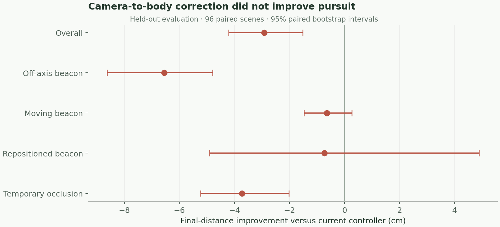
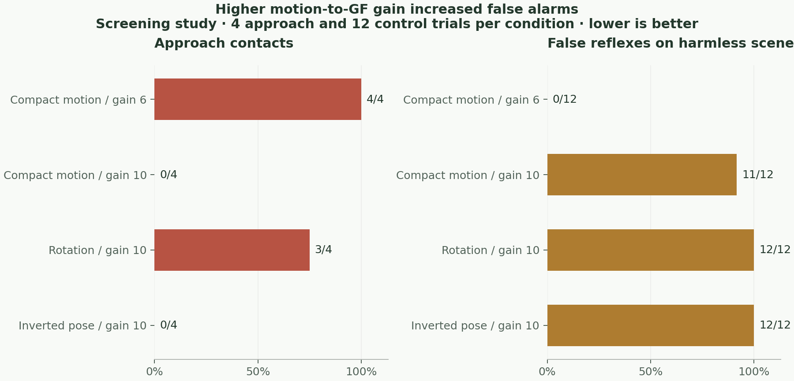

# DuckFly vision and feedback results

**10 September 2026. No new controller passed the promotion gates.** The existing active-looking option produced a modest improvement on fresh pursuit scenes. The proposed pose-corrected steering made pursuit worse. Raising neural sensitivity made the experimental looming circuit respond more often, including to harmless scenes.

We completed **624 matched simulator trials**, totaling 56.8 simulated minutes and 170,400 motor steps. These used actual duck-eye rendering and MuJoCo, with the fixed 61-input / 14-action ONNX walking policy. An additional 16 smoke trials checked the harness. All failures are retained. This is evidence about this simulator, not a hardware or biological validation.

## Pursuit: a modest existing benefit, a failed new adapter

The pilot contained 128 trials. It selected the coordinate-only adapter by the rule in [the protocol](protocol.md), then evaluated it on 96 fresh environments with four matched conditions, 384 trials altogether. Conditions shared the same scene and neural seed. Each trial ran for six simulated seconds.

| Condition | Mean final distance to beacon | Paired improvement over current controller, 95% interval |
|---|---:|---:|
| Current neutral-head controller | 26.82 cm | Reference |
| Existing active head looking | **25.15 cm** | **+1.67 cm [0.82, 2.66]** |
| Camera-to-body bearing correction | 29.73 cm | −2.91 cm [−4.14, −1.43] |
| Matched head command, steering pose correction removed | 26.93 cm | −0.11 cm [−1.43, 1.19] |

Active looking improved final error by **6.2%**. The largest family mean benefit was on repositioned beacons, 3.23 cm. This was a prespecified comparison, but its overall gain fell below the 3 cm promotion threshold. It stays an optional setting: **Scene tools → selected duck → Active head looking**.

Pose correction kept the target visible 93.94% of the time versus 91.58% for the current controller, and reduced mean absolute heading error from 0.149 to 0.136 rad. Yet the duck finished farther away. Removing only the steering correction improved the corrected candidate by 2.80 cm [1.52, 4.02]. Better image alignment did not translate into better locomotion. This rejects this implementation, not every possible use of camera pose.

There were no falls or prop contacts in the pursuit study. Every motor tick retained the target-visibility gate. The geometry and controller weights were fixed; the camera cadence remained 10 Hz for marker pursuit.

## Gait feedback did not establish a useful timing effect

Within the coordinated-gaze pilot, final error was 29.85 cm with measured gait phase, 29.58 cm with ascending feedback off, and 29.27 cm with an unrelated phase sequence. The measured phase did not outperform the controls. This is a small screen of that candidate, not a claim that body feedback is generally useless. No feedback setting was changed in the app.

## Looming: sensitivity and specificity must be tested together

A separate 48-trial screen used stereo rendered eyes at 25 Hz and the experimental compact motion-opponency → LPLC2 → GF path. It included head scanning, walking past background objects, physical approaches and lateral passes. Camera-rotation compensation warped the previous image into the current eye orientation; an inverted-pose control tested whether the sign of that feedback mattered.

At gain 6, compensation reduced false GF alarms from 2/12 to 0/12, but approach contacts increased from 2/4 to 3/4 and pre-contact reflexes fell from 1/4 to 0/4. It failed. The independent geometry check reduced image error from 0.1143 to 0.000627; a correct warp still did not establish a useful controller.

A prospectively declared follow-up tested the already-supported gain 10 on fresh scenes. It comprised 64 trials with a matched gain-6 baseline.

| Condition | Approach contacts | Pre-contact GF reflexes | False GF alarms on harmless scenes |
|---|---:|---:|---:|
| Compact motion, gain 6 | 4/4 | 0/4 | 0/12 |
| Compact motion, gain 10 | **0/4** | 4/4 | **11/12** |
| Rotation compensation, gain 10 | 3/4 | 4/4 | 12/12 |
| Inverted pose, gain 10 | 0/4 | 4/4 | 12/12 |

The higher gain behaved like an oversensitive smoke alarm. Contact avoidance alone would even make the incorrect-pose condition look successful. The harmless-scene controls expose the problem. These counts are small screening samples; neither motion candidate warranted a larger promotion study.

The traces also expose a feedback-loop issue worth testing next. In `rot-gainpilot-approach-2`, the corrected detector at gain 10 triggered GF at 0.86 s. The body slowed, but forward commands resumed around 1.86 s when the fixed stop latch expired. A second stop arrived later, and contact occurred at 2.96 s. This is an observed failure sequence, not proof that a longer stop alone would solve the task. Other trials stopped too late or still met an incoming object after stopping.

No trial in either motion screen fell. A GF alarm in the stationary scanning control is counted as a false neural alarm; manual zero-speed commands hold the body stationary there.

## Best next experiment

Start with a **temporal visual decoder trained on retinal sequences captured while this duck walks**. Supply measured camera rotation as an input and distinguish sustained object expansion from the duck's own image motion. Use scene truth only for training labels and evaluation, never as controller input. Split by entire trajectories and scene families; compare against absent pose and incorrect pose. Full Flyvis T4/T5 activity can be an offline candidate input, but its current numerical parity does not establish useful body control.

Then test a **hazard-aware stop-and-resume loop** using actual body speed. The visual decoder should decide whether danger persists, and the motor feedback should measure whether the duck has really stopped. Compare this with the existing timed GF latch, retaining false-stop duration as well as contacts. Keep circuit weights and the walking policy frozen. A candidate must earn both perceptual discrimination and physical task performance before replacing a default.

Head stabilization and embodied vision have precedent in [NeuroMechFly v2](https://www.nature.com/articles/s41592-024-02497-y). Its fly body and controller do not validate this biped adapter. The current experiments use the selected 668-neuron DesktopFly circuit, not full Flyvis driving the duck.

## What was added and checked

The repository now contains reusable physical experiment harnesses, incremental trial retention with pursuit resumption, and deterministic paired analysis. Candidate code remains under `experiments/feedback`; browser entry points are under `web/tests`. Production entry bundles stayed byte-identical to the existing build, so the Mac app and deployed web defaults are unchanged.

All **36 existing tests passed**, including visual interventions, stale-camera handling, deterministic replay and physics/policy integration. The web build passed. The fixed circuit, ONNX policy and motor implementation match [their frozen hashes](fixed-controller.sha256). Source snapshots and raw compressed evidence are retained below. See [README.md](README.md) for reproduction commands and the documented development-server interruption and resumption.

- [Pursuit pilot summary](reports/pilot-v1-summary.json) · [raw trials](reports/pilot-v1.json.gz)
- [Held-out pursuit summary](reports/pursuit-heldout-v1-summary.json) · [raw trials](reports/pursuit-heldout-v1.json.gz)
- [Rotation pilot summary](reports/motion-pilot-v1-summary.json) · [raw trials](reports/motion-pilot-v1.json.gz)
- [Gain follow-up summary](reports/motion-gain10-pilot-v1-summary.json) · [raw trials](reports/motion-gain10-pilot-v1.json.gz)
