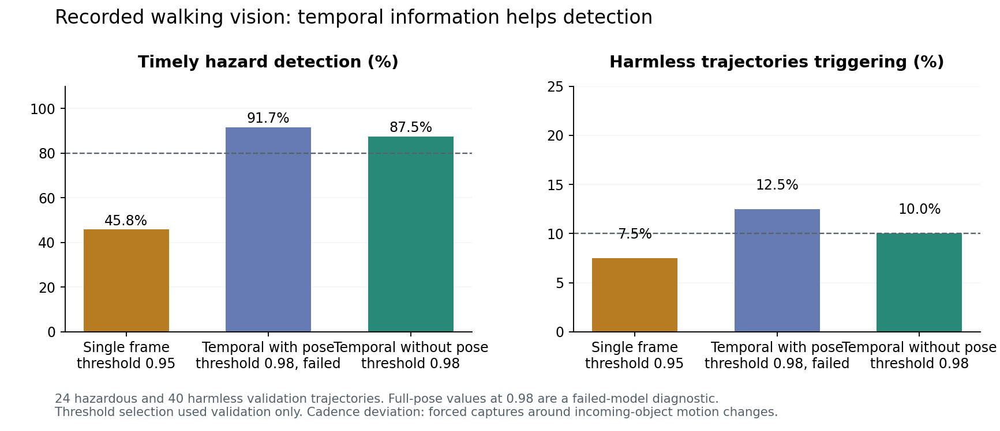
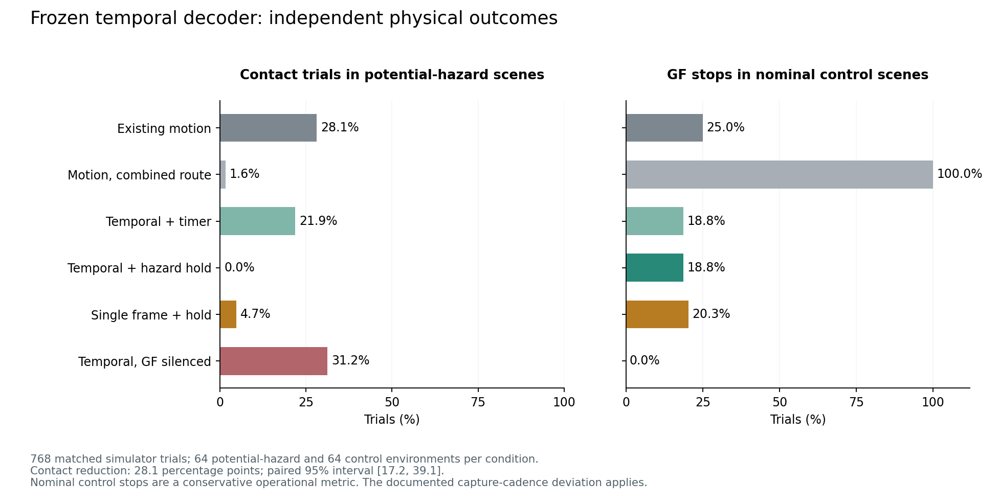
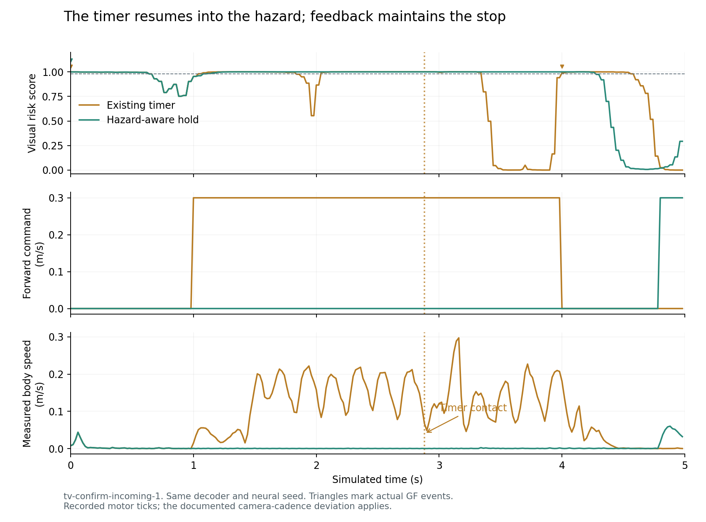

# Temporal vision and GF feedback: measured results

The hazard-aware hold prevented premature restarts in this simulator study. It reduced potential-hazard contact trials from **18/64 to 0/64**, with no falls. The same learned decoder with the existing timed stop produced **14/64** contact trials.

**No controller is promoted.** The candidate still produced GF events in **12/64 nominal control scenes (18.75%)**, exceeding the frozen 10% limit. Its rate was lower than the original baseline's 16/64, and control-scene forward progress was 99.95% of baseline, but those improvements do not waive the absolute gate. The study also has a documented camera-cadence protocol deviation.

[Open the visual replay](replay.html) to inspect recorded retinal inputs and the physical outcome figures. This is a local research artifact. The web and Mac application bundles remain unchanged.

## What was implemented

A small MLP consumes five pooled stereo luminance snapshots and measured feedback. Training used 256 actual walking-camera trajectories, with 64 independent validation trajectories. The retained data contains **40,050 stereo captures**. Scene geometry supplies training labels only; online inference receives the camera features and measured body/camera feedback.

A threshold crossing supplies a bounded 200 ms input to the existing combined LC4/LPLC2 route at GF gain 6. Only an actual GF event engages the new hold. It can release after fresh low-risk evidence persists for 400 ms and measured body speed stays below 0.04 m/s for 120 ms. It never manufactures a movement command or overrides silenced output.

The selected 668-neuron circuit and Microduck ONNX walking policy are fixed. The decoder is an engineered collision-risk adapter. It is not a biological reconstruction, and full Flyvis is still separate from body control.

## Perception results

The whole trajectory, rather than individual frames, defines each split. Model capacity and optimization budget were matched. Threshold selection used validation only.

| Model | Validation AUROC | Timely detection | Harmless trajectories triggering | Outcome |
|---|---:|---:|---:|---|
| Single-frame control | 0.960 | 11/24, 45.8% | 3/40, 7.5%, at 0.95 | Failed detection gate |
| Temporal with pose | 0.992 | 22/24, 91.7%* | 5/40, 12.5%, at 0.98* | No qualifying threshold |
| Temporal without pose | 0.991 | 21/24, 87.5% | 4/40, 10.0%, at 0.98 | Passed perception gate |

*Full-pose values at 0.98 are a failed-model diagnostic. No allowed threshold passed its false-trigger constraint. They are not a selected operating point.*

“No pose” zeroes camera angular velocity and head-alignment features. Body speed and gait feedback remain. This candidate was chosen in the written [follow-up](FOLLOWUP.md) before inspecting physical results. Its weights and threshold were then frozen.

Reversing the full model's temporal order reduced AUROC from 0.992 to 0.788. Negating pose features left it at 0.991. This supports dependence on sequence order, but does not establish a benefit from the added pose features or biological motion processing. The validation set is small, and its frame samples are correlated; AUROC is not evidence of deployment readiness.

## Independent physical test

**768 matched trials**: 16 fresh seeds in each of eight families, evaluated under six conditions. Each trial lasts five simulated seconds, for 64 simulated minutes in this stage. All outcomes are retained. Potential-hazard families are incoming, parked, crossing and retreat; the remaining families are nominal controls. These strata were fixed before physical evaluation.

| Condition | Potential-hazard contact trials | Control GF-event trials | Mean control forward progress |
|---|---:|---:|---:|
| Original compact motion | 18/64 | 16/64 | 32.9 cm |
| Compact motion, same combined neural route | 1/64 | 64/64 | 6.3 cm |
| Temporal decoder + existing timer | 14/64 | 12/64 | 32.9 cm |
| Temporal decoder + hazard-aware hold | **0/64** | **12/64** | **32.8 cm** |
| Single-frame decoder + hold | 3/64 | 13/64 | 33.0 cm |
| Temporal decoder, GF silenced | 20/64 | 0/64 | 34.4 cm |

No condition produced a fall. The primary candidate has no new matched falls. It also had no contacts in the nominal control scenes; the original baseline had one there.

The candidate's contact reduction versus the original baseline is **28.1 percentage points**, with a paired 95% bootstrap interval of **[17.2, 39.1]**. Isolating the feedback change against the same decoder with the old timer yields **21.9 points [12.5, 32.8]**. Those results support the stop/resume mechanism.

The temporal-versus-single-frame physical contrast is only **4.7 points [0.0, 10.9]**. Temporal history improved the chosen perception metric, but this physical study does not establish its superiority over the single-frame controller. Silencing GF prevents the supervisor from engaging and restores contact failures, supporting the intended neural dependency.

The “false-stop” gate uses any GF event in a nominal control trial. That includes stationary head-scan controls, where an event does not necessarily cause a new physical stop. Post-study diagnostics found **10 control trials with visual pulses** and **2 GF events without a visual pulse**, both during head scanning. Every affected control trace had zero positive engineered risk labels. The visual-pulse-associated rate alone is still 15.6%, above the limit, so this distinction does not change the failed decision.

## Why the hold helps

The first lexicographic timer-failure example is `tv-confirm-incoming-1`. Both controllers recruit GF immediately. The timer permits walking again at 1.0 s while the decoder still reports high risk; contact occurs at 2.88 s. The new supervisor keeps the forward command at zero, then releases it at 4.8 s after the object retreats and the clear/speed conditions are satisfied. These are actual retained motor ticks, not an animated explanation generated from the rule.

## Protocol deviation and provenance repair

The development server had cached the earlier incoming-object motion script. The intended script rounded velocity changes onto regular 25 Hz camera ticks; the executed script changed velocity on motor ticks and forced an additional capture. This added **41 training and 9 validation captures** beyond the 40,000 planned samples. Some input windows therefore span slightly less than the nominal 480 ms. The physical run used that same earlier script.

The discrepancy was discovered by the frame-count audit while the physical study was running. No weights, thresholds or promotion gates were retuned. All trials were retained. The actual served source was recovered from the Vite source map, reversing only its known import-URL rewriting. Both intended and executed files are archived, along with the served module and hashes in [source-deviation.json](reports/source-deviation.json). The working scene script was restored to the version that actually ran.

The paired comparisons remain descriptive evidence for the executed setup. They should not be presented as a flawless preregistered confirmation of the intended capture cadence. No default is changed, independently of this caveat, because the behavioral gate already failed.

Future runs now carry hashes exported by the served modules. The local server compares them with the current files before accepting a study and archives the matching sources. An actual browser falsifier changed a harmless on-disk comment while leaving the cached module intact: the server rejected the run before writing its header. A new eight-trajectory smoke run verified the valid path. Model artifacts have a corresponding check.

After the physical study's code had been loaded, a separate robustness fix made eye-cover invalidation take effect even when the timestamp is unchanged. Its regression test passes. It was not exercised by the completed physical cohort, which contained fresh, uncovered frames; the original feedback implementation is archived with that cohort. Production recording integration remains undone.

## Decision and next experiment

Keep the learned controller in the research harness. The next improvement should target false visual triggers while retaining the successful GF hold mechanism.

Use timestamp-based history sampling so forced captures do not compress the input window. Build a new training set with more harmless receding objects and head/body motion. Test a fixed, brief evidence-persistence rule against single-frame score spikes, including a fast-approach control so filtering cannot quietly sacrifice reaction time. Preserve this confirmation set as a completed result; any training informed by its failure examples requires a fresh final test set.

A camera-pose model should earn its place through an independent improvement. Raising neural gain is not supported here: changing only to the combined motion route stopped every control trial and sharply reduced progress.

## Retained checks

The evidence verifier checks dataset separation and frame shapes, lossless JSONL/compressed-report agreement, all 768 physical case/condition pairs, and 192,000 retained motor ticks. It verifies that each hold follows a GF event and zeros the corresponding body commands. GF-silenced trials contain no GF engagement. Python/browser decoder outputs agree within 1e-5 on the retained parity vectors.

The source and model guard has a real-browser rejection receipt as well as unit checks. Neural bridge checks cover 120 runs with GF and output interventions. The final test/build receipts are in `reports/acceptance.json`; [verification.json](reports/verification.json) records evidence hashes and the source deviation. No physical-robot or webcam generalization claim is made.
